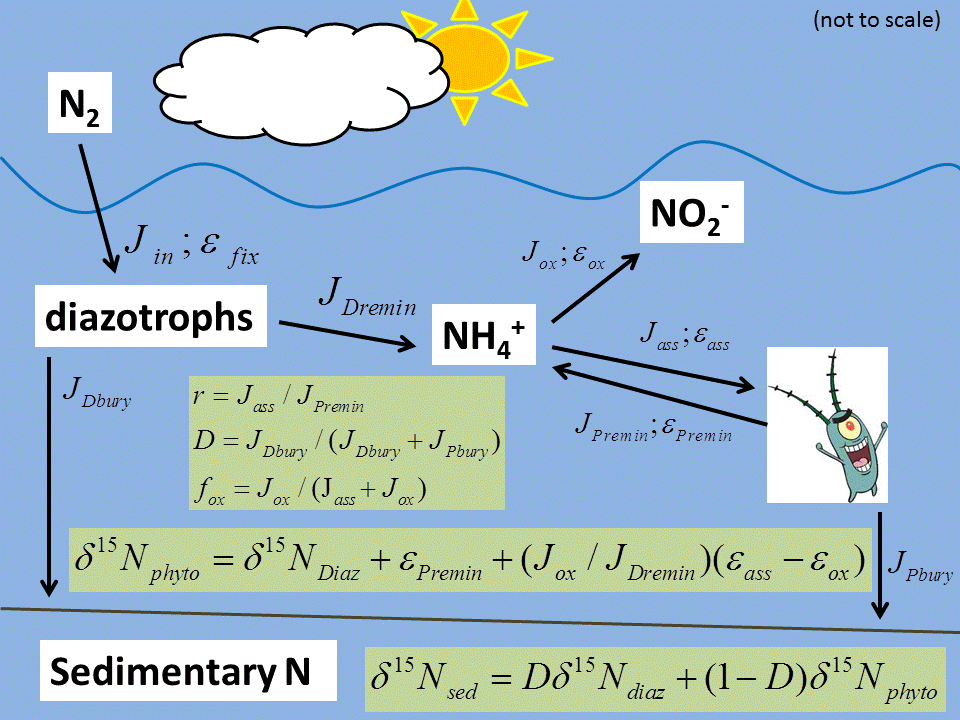

```{r "load packages", include=FALSE}
library(tidyverse)
knitr::opts_chunk$set(eval = FALSE)
```

# Setting up our model


## Here's the equations in full:

 - $\delta^{15}N_p = \delta^{15}N_d + \epsilon_{premin} + (J_{ox}/J_{dremin})(\epsilon_{ass} - \epsilon_{ox})$
 - $\delta^{15}N_{sed} = D * \delta^{15}N_d + (1-D) * \delta^{15}N_p$
 
With parameters:

 - $r = J_{ass}/J_{premin}$
 - $D = J_{dbury}/(J_{dbury} + J_{pbury})$
 - $f_{ox} = J_{ox}/(J_{ass}+J_{ox})$
 
And individual fluxes: 

 - $k = ((D-1)/(((1-f_{ox})/f_{ox})*(r-1)-1+D))$ 
 - $J_{dbury} = J_{in}*(1-k)*D$
 - $J_{pbury} = J_{in}*(1-k)*(1-D)$
 - $J_{dremin} = J_{in}*(1-(1-k)*D)$
 - $J_{ass} = J_{in}*k*((1-f_{ox})/f_{ox})$
 - $J_{premin} = r*(J_{in}*k*((1-f_{ox})/f_{ox}))$
 - $J_{ox} = J_{in}*k$
 
 
## Default values (from paper)

 - $D = 0.2$
 - $r = 0.8$
 - $\epsilon_{ass} = -27$
 - $\epsilon_{ox} = -22$
 - $\delta^{15}N_d = -1$


# Let's see this in image form:

```{r "N cycle model for OAE2", out.width = "100%", echo=FALSE, eval=TRUE}
 
```

# Example 1

Fixed remineralization fraction (r), variable oxidation fraction (f_ox) and serveral different scenarios for diazotroph burial (D).

```{r}
# constants
delta_diazotrophs <- -1
r <- 0.8
eps_ass <- -27 
eps_ox <- -22


# grid of variables
data1 <- expand.grid(
  f_ox = seq(0, 1, by = 0.01),
  D = c(0.2, 0.5, 1)
) %>% as_data_frame() %>% 
  mutate(
    delta_sed = delta_diazotrophs + ((1-D)*f_ox) / (f_ox + (1-f_ox) * (1-r)) * (eps_ass - eps_ox)
  )

# show the data
data1 %>% head() %>% knitr::kable()
```

## Visualize

```{r}
# base plot
base_plot <- 
  ggplot() +
  aes(x = f_ox, y = delta_sed, color = factor(D), linetype = factor(r)) +
  geom_line() + 
  geom_hline(yintercept = -2, color = "black", linetype = 2) +
  scale_x_continuous(name = latex2exp::TeX("$f_{ox}$"), 
                     expand = c(0,0), labels = function(x) paste(100*x, "%")) +
  scale_y_continuous(name = latex2exp::TeX("$\\delta^{15}N_{sed}$")) +
  scale_color_manual(name = "Diazotroph burial", 
                     labels = function(x) paste0(100*as.numeric(x), "%"), 
                     values = RColorBrewer::brewer.pal(6, "Dark2")) +
  scale_linetype_manual(name = "Phytoplankton\nRemineralization", 
                     labels = function(x) paste0(100*as.numeric(x), "%"),
                     values = 1:5) +
  expand_limits(y = 0) +
  theme_gray()
  
# plotting data 1
base_plot %+% data1
```

> Explain the behavior of each scenario (differing diazotroph burial): ?????

# Exercise 1

Now plot with variable remineralization (0%, 50%, 99%), using the constant (observed) diazotroph burial value from the paper.

```{r}
# data2
D <- 0.2
data2 <- expand.grid(
  f_ox = ???,
  r = ???
) %>% as_data_frame() %>% 
  mutate(
    delta_sed = delta_diazotrophs + ((1-D)*f_ox) / (f_ox + (1-f_ox) * (1-r)) * (eps_ass - eps_ox)
  )
base_plot %+% data2
```

> Why can't we plot r=100%? ???

> Explain the trends: ???


# Example 2

Now let's vary r, f_ox, and D all at the same time.

```{r}

# matrix of variables - just run this
data3 <- expand.grid(
  r = seq(0, 1, by =0.01),
  f_ox = seq(0, 1, by = 0.01),
  D = c(0.05, 0.1, 0.25, 0.5)
) %>% as_data_frame() %>% 
  mutate(
    delta_sed = delta_diazotrophs + (1-D)*f_ox / (f_ox + (1-f_ox) * (1-r)) * (eps_ass - eps_ox)
  )

data3 %>% head() %>% knitr::kable()
```

## Resulting contour plot

```{r, fig.width = 12}
# funky plot
data3 %>%
  mutate(D_panel = paste0("D: ", sprintf("%02d", 100*D), "%")) %>%
  ggplot() +
  aes(x = f_ox, y = r, z = delta_sed) +
  geom_contour(aes(colour = ..level..), binwidth = 0.005) + 
  geom_line(data = function(data) filter(data, abs(delta_sed + 2) < 0.03), 
            size = 1, colour = "black") +
  scale_color_gradientn(name = latex2exp::TeX("$\\delta^{15}N_{sed}"), 
                        colours = rainbow(5),
                        labels = function(x) paste(x, "\u2030")) +
  scale_y_continuous(name = "phytoplankton remineralization (r)", expand = c(0,0), labels = function(x) paste(100*x, "%")) +
  scale_x_continuous(name = latex2exp::TeX("$f_{ox}$"), expand = c(0,0), labels = function(x) paste(100*x, "%")) +
  #facet_grid(~r)
  facet_grid(~D_panel)
```

> What does this mean for the high D scenario? And what does that imply for this ocean anoxic event? ???

# Exercise 2: change isotopic effect of assimilation - oxidation

First let's split up into groups to play with the eps_ass - eps_ox parameter. We'll use the 18 eps_ox value for pH of 8 and simply ajust eps_ass within a reasonable range. Group (1) will set eps_ass - eps_ox positive. Group (2) sill set eps_ass - eps_ox negative. Group (3) will set eps_ass = eps_ox. Each group will present their results to the class, preferably as a rap or shakespearean sonnet. 

```{r}
#Group one: how does changing eps_ox to -18 compare to -22? What happens when eps_ox is even lower?
# constants
delta_diazotrophs <- -1
r <- 0.8

# comment this one back in and change value
#eps_ass <- ??? 
#eps_ox <- ???

# grid of variables
data4 <- expand.grid(
  f_ox = seq(0, 1, by = 0.01),
  D = c(0.2, 0.5, 0.9)
) %>% as_data_frame() %>% 
  mutate(
    delta_sed = delta_diazotrophs + ((1-D)*f_ox) / (f_ox + (1-f_ox) * (1-r)) * (eps_ass - eps_ox)
  )

base_plot %+% data4
```

```{r}
#Group two: explain these trends
# constants
delta_diazotrophs <- -1
r <- 0.8

# comment this one back in and change value
#eps_ass <- ??? 
#eps_ox <- ???

# grid of variables
data5 <- expand.grid(
  f_ox = seq(0, 1, by = 0.01),
  D = c(0.2, 0.5, 0.9)
) %>% as_data_frame() %>% 
  mutate(
    delta_sed = delta_diazotrophs + ((1-D)*f_ox) / (f_ox + (1-f_ox) * (1-r)) * (eps_ass - eps_ox)
  )

base_plot %+% data5
```


```{r}
#Group three: explain the trend
# constants
delta_diazotrophs <- -1
r <- 0.8

# comment this one back in and change value
#eps_ass <- ??? 
#eps_ox <- ???

# grid of variables
data6 <- expand.grid(
  f_ox = seq(0, 1, by = 0.01),
  D = c(0.2, 0.5, 0.9)
) %>% as_data_frame() %>% 
  mutate(
    delta_sed = delta_diazotrophs + ((1-D)*f_ox) / (f_ox + (1-f_ox) * (1-r)) * (eps_ass - eps_ox)
  )

base_plot %+% data6
```


# Exercise 3 (if there is time): change isotope effect of nitrogen fixation

We will look at a paper by Zhang et al. 2014 describing alternative nitrogenaze enzymes and their different isotope effects. This is an important reminder that uniformatarianism doesn't necessarily hold for biological systems and deep-time climate systems. Now we'll play with those, since we've constrained the other variables. Let's use the diazotroph d15N value using the +V,Fe enzyme per Zhang et al. 2014 (-5 per mil). Play around with the other variables (r, D, eps_ass-aps_ox) until you reach d15N_sed=-2.

```{r}
delta_diazotrophs <- -5
r <- 0.8
eps_ass <- -27 
eps_ox <- -22


# grid of variables
data7 <- expand.grid(
  f_ox = seq(0, 1, by = 0.01),
  D = c(0.2, 0.5, 0.9)
) %>% as_data_frame() %>% 
  mutate(
    delta_sed = delta_diazotrophs + ((1-D)*f_ox) / (f_ox + (1-f_ox) * (1-r)) * (eps_ass - eps_ox)
  )
  
# plotting data 1
base_plot %+% data7

```

> Describe trends and variables:????
